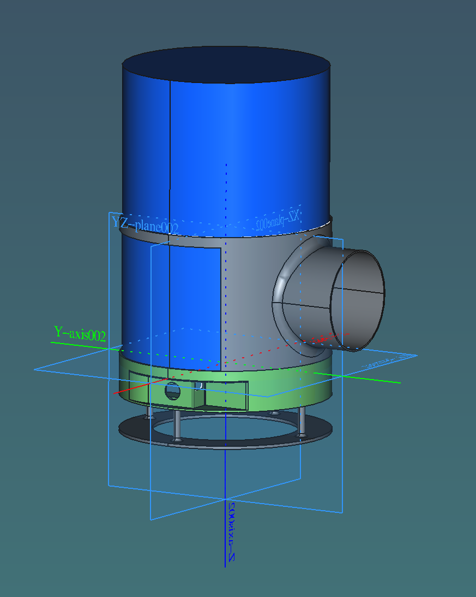

# Compact Air Purifier (3D Printed)

This is a **compact air purifier** designed for 3D printing.
It is compatible with **Xiaomi Mi Air Purifier filters (200 mm diameter)**.

An **optional side adapter** is included to connect a **100 mm tube**,
for example from a 3D printer enclosure or other equipment.

---

## Features

- Compatible with Xiaomi Mi Air Purifier filter (200 mm).
- Optional 100 mm tube connector.
- Designed for easy FDM printing.
- Simple modular construction.

---

## Hardware Used

- **Fan:** Arctic P14 Pro PST White (140 mm).
- **Control:** [Type C PWM Speed Controller](https://aliexpress.ru/item/1005006220888976.html).
- **Power:** Any suitable DC power adapter (speed charger).

You may use equivalent fans or controllers if available.

---

## Printing Notes

- Recommended material: PLA or PETG
